# PRD — Ứng dụng nhắc uống thuốc cá nhân hoá

## 1. Tổng quan sản phẩm

Ứng dụng hỗ trợ người dùng duy trì lịch uống thuốc bằng một hành trình nhắc nhở có thể tuỳ chỉnh, vui vẻ nhưng đủ quyết liệt để người dùng không vô tình bỏ qua.

Thay vì chỉ gửi một notification thông thường, ứng dụng:

* Nhắc theo nhiều cấp độ tăng dần.
* Yêu cầu người dùng xác nhận bằng ảnh thuốc khi cần.
* Ghi nhận cách người dùng phản ứng với từng lời nhắc.
* Đưa ra đề xuất điều chỉnh lịch nhắc dựa trên hành vi thực tế.
* Cho phép nhập đơn thuốc bằng OCR hoặc tạo thủ công.
* Nhắc người dùng chuẩn bị và mang thuốc trước khi ra ngoài.

Mascot mèo hoạt hình là nhân vật đồng hành xuyên suốt ứng dụng. Biểu cảm của mèo thay đổi từ vui vẻ, lo lắng đến hơi giận tuỳ theo mức độ nhắc nhở.

---

# 2. Mục tiêu sản phẩm

## 2.1. Mục tiêu chính

Giúp người dùng:

1. Biết chính xác hôm nay cần uống thuốc gì và vào lúc nào.
2. Giảm số lần quên hoặc uống thuốc quá trễ.
3. Dễ dàng tạo lịch thuốc từ đơn thuốc giấy hoặc nhập thủ công.
4. Chủ động chuẩn bị thuốc khi sắp ra ngoài.
5. Có một lịch nhắc phù hợp với thói quen cá nhân thay vì dùng một lịch cố định cho tất cả mọi người.

## 2.2. Giá trị khác biệt

Điểm đặc biệt của sản phẩm là **Adaptive Medication Journey**:

> Ứng dụng không chỉ nhắc uống thuốc mà còn học cách người dùng phản ứng với lời nhắc, sau đó đề xuất một hành trình nhắc phù hợp hơn.

## 2.3. Đối tượng sử dụng

### Người dùng chính

* Người đang sử dụng thuốc theo liệu trình.
* Người lớn tuổi cần giao diện rõ ràng, dễ thao tác.
* Người thường quên uống thuốc hoặc uống không đúng giờ.
* Người có nhiều loại thuốc và nhiều khung giờ uống khác nhau.

### Người dùng phụ trong tương lai

* Người thân theo dõi việc uống thuốc.
* Người chăm sóc.
* Bác sĩ hoặc nhân viên y tế.

---

# 3. Nguyên tắc trải nghiệm

## 3.1. Friendly, not childish

Giao diện vui vẻ và có mascot, nhưng không được tạo cảm giác đây là ứng dụng dành cho trẻ em.

## 3.2. Supportive, not judgmental

Ứng dụng không dùng ngôn ngữ trách móc như:

* “Bạn lại quên uống thuốc.”
* “Bạn đã thất bại.”
* “Bạn không tuân thủ lịch.”

Thay vào đó, sử dụng ngôn ngữ nhẹ nhàng:

* “Có vẻ hôm nay bạn hơi bận. Mình vẫn ở đây để nhắc bạn nhé.”
* “Bạn thường uống thuốc muộn hơn khoảng 20 phút. Mình điều chỉnh thời gian nhắc sớm hơn một chút nha?”
* “Không sao, mình ghi nhận lại để giúp lịch nhắc ngày mai phù hợp hơn.”

## 3.3. Clear before clever

Mọi màn hình phải ưu tiên:

1. Thuốc nào?
2. Uống bao nhiêu?
3. Uống lúc nào?
4. Người dùng cần làm gì tiếp theo?

Mascot và animation chỉ đóng vai trò hỗ trợ, không được làm mất trọng tâm.

## 3.4. Người dùng luôn có quyền kiểm soát

AI chỉ đưa ra đề xuất. Mọi thay đổi lịch nhắc phải được người dùng xác nhận trước khi áp dụng.

---

# 4. Phạm vi MVP

## 4.1. Trong phạm vi

* Dashboard danh sách thuốc.
* Xem chi tiết thuốc.
* Tạo đơn thuốc thủ công.
* Quét đơn thuốc bằng OCR.
* Kiểm tra và chỉnh sửa kết quả OCR.
* Calendar hành trình uống thuốc.
* Tuỳ chỉnh giờ uống và thời gian nhắc.
* Tuỳ chỉnh mức độ leo thang của notification.
* Nhắc chuẩn bị thuốc.
* Nhắc mang thuốc.
* Notification với hai hành động:

  * Đã uống.
  * Nhắc mình sau.
* Chụp ảnh xác nhận trong ứng dụng.
* AI nhận diện sơ bộ xem ảnh có vật thể giống thuốc hay không.
* Ghi nhận hành vi phản hồi notification.
* Recap tuần.
* Đề xuất điều chỉnh lịch nhắc.

## 4.2. Ngoài phạm vi MVP

* AI xác minh chính xác tên, liều lượng hoặc loại viên thuốc từ ảnh xác nhận.
* Chẩn đoán bệnh.
* Đưa ra lời khuyên thay đổi liều thuốc.
* Tự động thay đổi lịch mà không hỏi người dùng.
* Liên kết nhà thuốc.
* Đặt thuốc trực tiếp.
* Đồng bộ dữ liệu với bệnh viện.
* Theo dõi bởi bác sĩ hoặc người thân.
* Thay thế tư vấn chuyên môn của bác sĩ hoặc dược sĩ.

---

# 5. Điều hướng chính

Bottom navigation gồm bốn mục:

1. **Hôm nay**
2. **Lịch thuốc**
3. **Đơn thuốc**
4. **Cá nhân**

Nút hành động chính:

* Nút “+” nổi để thêm thuốc hoặc quét đơn thuốc.
* Camera được mở trực tiếp từ notification khi người dùng chọn xác nhận.

---

# 6. Hệ thống thiết kế giao diện

## 6.1. Phong cách

* Mobile-first.
* Fun, modern và ấm áp.
* Bo góc lớn.
* Card rõ ràng.
* Khoảng trắng rộng.
* Icon đơn giản, dễ hiểu.
* Không sử dụng quá nhiều màu trên một màn hình.

## 6.2. Mascot mèo

Mascot có các trạng thái:

| Trạng thái  | Biểu cảm                | Trường hợp sử dụng              |
| ----------- | ----------------------- | ------------------------------- |
| Happy       | Vui vẻ, vẫy tay         | Hoàn thành đúng giờ             |
| Gentle      | Bình thường, thân thiện | Notification đầu tiên           |
| Concerned   | Hơi lo lắng             | Đã bỏ qua một lần               |
| Impatient   | Khoanh tay, cau mày nhẹ | Đã trễ nhiều lần                |
| Celebrating | Tung confetti           | Hoàn thành streak hoặc tuần tốt |
| Supportive  | Ôm hộp thuốc            | Recap có nhiều lần bỏ lỡ        |

Mascot không được thể hiện sự tức giận quá mạnh hoặc khiến người dùng cảm thấy bị phán xét.

## 6.3. Khả năng tiếp cận

* Font nội dung chính tối thiểu 16px.
* Thông tin thuốc quan trọng từ 18–22px.
* Nút chính có chiều cao tối thiểu 48px.
* Vùng chạm tối thiểu 44 × 44px.
* Không chỉ sử dụng màu sắc để biểu thị trạng thái.
* Hỗ trợ Dynamic Type nếu nền tảng cho phép.
* Tương phản màu đáp ứng chuẩn accessibility cơ bản.
* Hạn chế đoạn văn dài.
* Luôn có label bên cạnh icon quan trọng.

---

# 7. Feature 01 — Dashboard thuốc

## 7.1. Mục tiêu

Cho phép người dùng nhìn nhanh:

* Hôm nay cần uống thuốc gì.
* Thuốc nào sắp đến giờ.
* Liệu trình nào đang diễn ra.
* Tiến độ uống thuốc trong ngày.

## 7.2. Giao diện

### Header

* Lời chào theo thời gian:

  * “Chào buổi sáng, Ngọc!”
  * “Hôm nay mình có 3 lần uống thuốc.”
* Mascot mèo xuất hiện cạnh lời chào.
* Avatar hoặc nút profile ở góc phải.

### Progress hôm nay

Hiển thị:

* Số lần đã hoàn thành.
* Tổng số lần cần uống.
* Mốc tiếp theo.
* Thanh tiến độ hoặc vòng tròn tiến độ.

Ví dụ:

> Đã hoàn thành 2/4 lần
> Tiếp theo: Panadol lúc 14:00

### Card thuốc

Mỗi loại thuốc là một card riêng, gồm:

* Tên thuốc.
* Liều dùng.
* Các buổi cần uống:

  * Sáng.
  * Trưa.
  * Chiều.
  * Tối.
* Ngày bắt đầu.
* Thời gian liệu trình còn lại.
* Trạng thái hôm nay:

  * Sắp tới.
  * Đã uống.
  * Trễ.
  * Đã bỏ qua.
* Icon hoặc ảnh thuốc nếu có.

Ví dụ:

**Amoxicillin**

1 viên · Sáng và tối
Còn 5 ngày
Tiếp theo lúc 20:00

## 7.3. Behavior khi bấm card

Khi người dùng bấm vào card thuốc, mở màn hình Medication Details.

### Thông tin hiển thị

* Tên thuốc.
* Tên hoạt chất nếu có.
* Liều lượng.
* Dạng thuốc.
* Số lượng mỗi lần uống.
* Hướng dẫn:

  * Trước ăn.
  * Sau ăn.
  * Trong khi ăn.
  * Không xác định.
* Các giờ uống.
* Ngày bắt đầu.
* Ngày kết thúc.
* Bác sĩ hoặc cơ sở khám nếu có.
* Ghi chú.
* Nguồn dữ liệu:

  * Nhập thủ công.
  * OCR từ đơn thuốc.

### Hành động

* Chỉnh sửa.
* Tạm dừng lịch.
* Kết thúc liệu trình.
* Xoá thuốc.
* Xem lịch sử uống.

## 7.4. Acceptance criteria

* Người dùng xem được tất cả thuốc đang hoạt động trên dashboard.
* Mỗi card hiển thị tối thiểu tên, lịch uống và thời gian liệu trình.
* Thuốc gần đến giờ nhất được ưu tiên hiển thị phía trên.
* Bấm card phải mở đúng chi tiết thuốc.
* Thông tin chỉnh sửa ở màn hình chi tiết phải được cập nhật lại trên dashboard.
* Thuốc đã kết thúc không hiển thị trong danh sách đang hoạt động.

---

# 8. Feature 02 — Tạo đơn thuốc thủ công

## 8.1. Mục tiêu

Cho phép người dùng thêm thuốc mà không cần đơn thuốc giấy hoặc trong trường hợp OCR không đọc được.

## 8.2. Entry points

Người dùng có thể bắt đầu từ:

* Nút “+” trên dashboard.
* Tab Đơn thuốc.
* Màn hình kết quả OCR.
* Empty state khi chưa có thuốc.

## 8.3. Các trường dữ liệu

### Bắt buộc

* Tên thuốc.
* Liều dùng mỗi lần.
* Đơn vị:

  * Viên.
  * Gói.
  * ml.
  * Giọt.
  * Lần xịt.
  * Khác.
* Tần suất uống.
* Ngày bắt đầu.
* Thời lượng hoặc ngày kết thúc.

### Không bắt buộc

* Hàm lượng.
* Dạng thuốc.
* Ảnh thuốc.
* Uống trước hoặc sau ăn.
* Ghi chú.
* Tên bác sĩ.
* Nơi khám.
* Mục đích sử dụng.
* Ngày tái khám.

## 8.4. Cách thiết lập lịch

Người dùng có thể chọn một trong hai cách:

### Theo buổi

* Sáng.
* Trưa.
* Chiều.
* Tối.
* Trước khi ngủ.

Hệ thống gán giờ mặc định và cho phép chỉnh sửa.

Ví dụ:

* Sáng: 08:00.
* Trưa: 12:00.
* Chiều: 17:00.
* Tối: 20:00.
* Trước khi ngủ: 22:30.

### Theo giờ cụ thể

Người dùng chọn một hoặc nhiều thời điểm trong ngày.

## 8.5. Validation

* Tên thuốc không được để trống.
* Liều lượng phải lớn hơn 0.
* Phải có ít nhất một thời điểm uống.
* Ngày kết thúc không được trước ngày bắt đầu.
* Nếu nhập cả thời lượng và ngày kết thúc, hai giá trị phải nhất quán.
* Các lịch uống trùng nhau phải được cảnh báo nhưng không bắt buộc chặn.

## 8.6. Copy gợi ý

* Tiêu đề: “Thêm thuốc mới”
* Mô tả: “Điền những gì bạn biết trước nhé. Bạn luôn có thể chỉnh lại sau.”
* CTA: “Lưu vào lịch”
* Thành công: “Xong rồi! Mình sẽ nhắc bạn từ lần uống tiếp theo.”

## 8.7. Acceptance criteria

* Người dùng có thể tạo thuốc mới mà không cần quét đơn.
* Hệ thống không cho lưu khi thiếu trường bắt buộc.
* Sau khi lưu, thuốc xuất hiện trên dashboard và calendar.
* Người dùng có thể quay lại chỉnh sửa mọi thông tin đã nhập.
* Mọi thay đổi liên quan đến giờ uống phải cập nhật lại lịch notification tương ứng.

---

# 9. Feature 03 — OCR đơn thuốc

## 9.1. Mục tiêu

Giảm thời gian nhập liệu bằng cách trích xuất thông tin từ ảnh đơn thuốc.

## 9.2. Luồng người dùng

1. Người dùng chọn “Quét đơn thuốc”.
2. Chụp ảnh hoặc chọn ảnh từ thư viện.
3. Hệ thống kiểm tra chất lượng ảnh.
4. Ảnh được gửi để phân tích.
5. Hệ thống hiển thị dữ liệu trích xuất.
6. Người dùng kiểm tra và chỉnh sửa.
7. Người dùng xác nhận tạo lịch thuốc.

## 9.3. Dữ liệu cần trích xuất

### Thông tin đơn thuốc

* Tên bệnh nhân nếu có.
* Ngày kê đơn.
* Tên bác sĩ.
* Cơ sở khám.
* Ngày tái khám.

### Thông tin từng thuốc

* Tên thuốc.
* Hàm lượng.
* Dạng thuốc.
* Số lượng.
* Liều mỗi lần.
* Số lần mỗi ngày.
* Buổi hoặc giờ uống.
* Trước hay sau ăn.
* Số ngày sử dụng.
* Ghi chú liên quan.

## 9.4. Trạng thái dữ liệu

Mỗi field OCR có một confidence state:

* **Tin cậy cao:** hiển thị bình thường.
* **Cần kiểm tra:** highlight nhẹ và có nhãn “Bạn kiểm tra lại giúp mình nhé”.
* **Không đọc được:** để trống và yêu cầu nhập thủ công.

Không hiển thị phần trăm confidence kỹ thuật cho người dùng phổ thông.

## 9.5. Màn hình review OCR

Mỗi thuốc nằm trong một card có thể mở rộng.

Card gồm:

* Tên thuốc.
* Liều dùng.
* Tần suất.
* Số ngày uống.
* Nhãn “Cần kiểm tra” nếu dữ liệu chưa chắc chắn.

Người dùng có thể:

* Chỉnh từng trường.
* Thêm thuốc bị thiếu.
* Xoá thuốc nhận diện nhầm.
* Chụp lại đơn.
* Xác nhận tất cả.

## 9.6. Nguyên tắc an toàn

* Không tự động tạo lịch trước khi người dùng xác nhận.
* Luôn hiển thị thông báo:

> “Thông tin được đọc tự động từ ảnh và có thể chưa hoàn toàn chính xác. Bạn hãy đối chiếu lại với đơn thuốc hoặc hỏi bác sĩ/dược sĩ khi chưa chắc chắn.”

* AI không được tự suy đoán liều khi ảnh không rõ.
* Field không chắc chắn phải để trống hoặc đánh dấu cần kiểm tra.
* Không tự động sửa tên thuốc thành một thuốc khác chỉ vì gần giống.

## 9.7. Các trạng thái lỗi

### Ảnh mờ

> “Ảnh hơi mờ nên mình chưa đọc rõ một vài chỗ. Bạn có thể dùng kết quả hiện tại hoặc chụp lại dưới ánh sáng tốt hơn.”

### Ảnh bị cắt

> “Có vẻ một phần đơn thuốc nằm ngoài khung hình.”

### Không tìm thấy đơn thuốc

> “Mình chưa nhận ra nội dung đơn thuốc trong ảnh này. Bạn thử chụp gần hơn hoặc thêm thuốc thủ công nhé.”

### Service timeout

> “Mình chưa phân tích được ảnh lúc này. Ảnh của bạn vẫn được giữ lại để bạn thử lại.”

## 9.8. Acceptance criteria

* Người dùng có thể chụp hoặc chọn ảnh.
* Hệ thống hiển thị trạng thái đang xử lý.
* Kết quả OCR phải được review trước khi tạo lịch.
* Người dùng chỉnh sửa được mọi field.
* Field không chắc chắn được đánh dấu rõ ràng.
* Lỗi OCR không làm mất ảnh hoặc dữ liệu người dùng đã nhập.
* Người dùng luôn có lựa chọn chuyển sang nhập thủ công.

---

# 10. Feature 04 — Custom Journey và Calendar

## 10.1. Mục tiêu

Cho phép người dùng xem toàn bộ hành trình uống thuốc theo ngày và tuỳ chỉnh cách ứng dụng nhắc cho từng buổi uống.

## 10.2. Giao diện chính

Màn hình gồm:

### Calendar tháng hoặc tuần

Mỗi ngày có trạng thái:

* Hoàn thành đầy đủ.
* Hoàn thành một phần.
* Có lần uống trễ.
* Có lần bỏ lỡ.
* Chưa đến ngày.

Không dùng màu làm tín hiệu duy nhất; kết hợp icon hoặc pattern.

### Agenda theo ngày

Khi chọn một ngày, hiển thị các buổi:

* Sáng.
* Trưa.
* Chiều.
* Tối.
* Trước khi ngủ.

Mỗi buổi có:

* Thời gian.
* Danh sách thuốc cần uống.
* Trạng thái.
* Nút chỉnh lịch nhắc.

Ví dụ:

**Buổi sáng · 08:00**

* Amoxicillin · 1 viên
* Vitamin C · 1 viên
  Sau ăn

## 10.3. Behavior khi chọn một buổi

Mở bottom sheet hoặc màn hình Session Details.

Hiển thị:

* Các thuốc thuộc buổi đó.
* Giờ uống mục tiêu.
* Khoảng thời gian hợp lệ.
* Kiểu nhắc.
* Hình thức xác nhận.
* Nhắc chuẩn bị.
* Nhắc mang thuốc.

## 10.4. Khoảng thời gian theo buổi

Nếu người dùng chỉ chọn “buổi” mà không chọn giờ cụ thể, hệ thống sử dụng một khoảng thời gian mặc định.

Ví dụ:

| Buổi          | Khoảng mặc định | Giờ nhắc đề xuất |
| ------------- | --------------- | ---------------- |
| Sáng          | 06:00–10:00     | 08:00            |
| Trưa          | 11:00–14:00     | 12:00            |
| Chiều         | 15:00–18:00     | 17:00            |
| Tối           | 18:00–21:30     | 20:00            |
| Trước khi ngủ | 21:00–00:00     | 22:30            |

Người dùng được phép điều chỉnh các giá trị trên.

## 10.5. Journey configuration

Người dùng có thể cấu hình:

### Thời gian uống mục tiêu

Ví dụ: 20:00.

### Thời điểm bắt đầu nhắc

Ví dụ:

* Đúng giờ.
* Trước 5 phút.
* Trước 15 phút.
* Trước 30 phút.
* Tuỳ chỉnh.

### Escalation interval

Ví dụ:

* Nhắc lại sau 15 phút.
* Sau đó 10 phút.
* Sau đó 5 phút.
* Sau đó mỗi 3 phút.

### Mức leo thang tối đa

* Nhẹ nhàng.
* Cân bằng.
* Quyết liệt.
* Tuỳ chỉnh.

### Cách hoàn thành

* Bấm “Đã uống”.
* Chụp ảnh thuốc.
* Chụp ảnh và xác nhận thêm một lần.
* Không yêu cầu bằng chứng.

### Ask me later duration

* 5 phút.
* 10 phút.
* 15 phút.
* 30 phút.
* Tuỳ chỉnh.

### Âm thanh và rung

* Im lặng.
* Rung.
* Âm thanh nhẹ.
* Âm thanh tăng dần.

## 10.6. Preset journey

### Nhẹ nhàng

* Một notification đúng giờ.
* Nhắc lại sau 15 phút.
* Không yêu cầu ảnh.

### Cân bằng

* Notification đúng giờ.
* Nhắc lại sau 10 phút.
* Sau đó 5 phút.
* Yêu cầu ảnh ở lần nhắc thứ ba.

### Quyết liệt

* Notification đúng giờ.
* Nhắc lại sau 10 phút.
* Sau đó 5 phút.
* Sau đó mỗi 3 phút.
* Yêu cầu chụp ảnh để hoàn thành.

## 10.7. Acceptance criteria

* Người dùng xem được lịch thuốc theo ngày.
* Chọn một ngày phải hiển thị đúng các buổi uống thuốc.
* Chọn một buổi phải hiển thị đúng danh sách thuốc.
* Người dùng chỉnh được giờ và journey của từng buổi.
* Thay đổi chỉ áp dụng sau khi người dùng lưu.
* Người dùng chọn được áp dụng cho:

  * Chỉ lần này.
  * Từ ngày này trở đi.
  * Toàn bộ liệu trình.
* Hệ thống phải huỷ notification cũ và tạo notification mới sau khi lịch được thay đổi.

---

# 11. Feature 05 — Nhắc chuẩn bị thuốc và mang thuốc

## 11.1. Mục tiêu

Giúp người dùng có thuốc bên mình trước khi đến giờ uống, đặc biệt khi đi học, đi làm hoặc ra ngoài.

## 11.2. Nhắc chuẩn bị thuốc

Người dùng có thể bật nhắc trước mỗi buổi uống.

Ví dụ:

* Trước 5 phút.
* Trước 15 phút.
* Trước 30 phút.
* Trước 1 giờ.
* Tuỳ chỉnh.

Copy:

> “Sắp đến giờ uống thuốc rồi. Bạn chuẩn bị Amoxicillin và một ly nước nhé.”

## 11.3. Nhắc mang thuốc

Người dùng có thể:

* Bật cố định theo từng ngày.
* Chọn các ngày trong tuần.
* Chọn giờ nhắc.
* Chọn thuốc cần mang.
* Chọn ngày cụ thể.

Ví dụ:

> “Hôm nay bạn có liều lúc 14:00. Nhớ mang theo 1 viên Amoxicillin nha.”

## 11.4. Quick setup

Khi một liều thuốc nằm trong khung giờ người dùng thường ở bên ngoài, ứng dụng có thể gợi ý:

> “Bạn có muốn mình nhắc mang thuốc trước khi ra ngoài không?”

Trong MVP, hệ thống không cần tự động đọc vị trí hoặc calendar. Đề xuất có thể xuất hiện khi người dùng chủ động bật tính năng.

## 11.5. Acceptance criteria

* Người dùng bật hoặc tắt riêng từng loại nhắc.
* Người dùng tuỳ chỉnh được thời gian nhắc.
* Notification phải ghi rõ cần chuẩn bị hoặc mang thuốc nào.
* Thay đổi lịch thuốc phải cập nhật lại reminder chuẩn bị và mang thuốc.
* Nếu thuốc đã tạm dừng hoặc kết thúc, reminder liên quan phải được huỷ.

---

# 12. Feature 06 — Notification leo thang

## 12.1. Mục tiêu

Tăng khả năng người dùng phản hồi mà không tạo cảm giác bị làm phiền quá mức.

## 12.2. Notification banner

Notification ưu tiên banner lớn và dễ đọc.

Nội dung gồm:

* Mascot mèo.
* Tên thuốc.
* Liều lượng.
* Hướng dẫn ngắn.
* Thời gian mục tiêu.
* Hai nút:

  * **Xác nhận**
  * **Nhắc mình sau**

Ví dụ:

> **Đến giờ uống thuốc rồi**
> Amoxicillin · 1 viên · Sau ăn
> Mình đợi bạn xác nhận nhé.

## 12.3. Hai hành động chính

### Xác nhận

* Nếu journey không yêu cầu ảnh:

  * Đánh dấu đã uống.
  * Hiển thị feedback thành công.
* Nếu journey yêu cầu ảnh:

  * Mở camera trong ứng dụng.
  * Không đánh dấu hoàn thành cho đến khi người dùng gửi ảnh hoặc chọn xác nhận thủ công nếu được cho phép.

### Nhắc mình sau

* Hiển thị các lựa chọn nhanh:

  * 5 phút.
  * 10 phút.
  * 15 phút.
  * 30 phút.
* Có thể sử dụng thời lượng mặc định theo journey.
* Ghi nhận sự kiện snooze.

## 12.4. Escalation states

### Level 1 — Gentle

Mascot vui vẻ.

> “Đến giờ uống thuốc rồi nè.”

### Level 2 — Reminder

Mascot hơi lo.

> “Mình vẫn đang đợi bạn xác nhận liều thuốc này.”

### Level 3 — Urgent

Mascot nghiêm túc hơn.

> “Liều thuốc đã trễ 15 phút. Bạn uống khi thuận tiện và xác nhận giúp mình nhé.”

### Level 4 — Repeated

Mascot khoanh tay hoặc cầm đồng hồ.

> “Mình sẽ tiếp tục nhắc vì liều này vẫn chưa được xác nhận.”

Ngôn ngữ không được mang tính đe doạ, sỉ nhục hoặc gây hoảng loạn.

## 12.5. Quy tắc 3 phút giảm dần

Một cấu hình escalation mẫu:

* T0: Đúng giờ.
* T+15: Nhắc lần hai.
* T+25: Nhắc lần ba.
* T+30: Nhắc lần bốn.
* T+33 trở đi: Nhắc mỗi 3 phút cho đến khi:

  * Người dùng xác nhận.
  * Chọn nhắc sau.
  * Chọn bỏ qua.
  * Đạt ngưỡng tối đa do người dùng thiết lập.

Không sử dụng lịch 3 phút vô hạn. Journey phải có:

* Số lần nhắc tối đa; hoặc
* Thời gian kết thúc escalation.

## 12.6. Ignore và missed dose

Trong giao diện mở rộng, người dùng có thể chọn:

* “Bỏ qua lần này.”
* “Mình đã uống nhưng quên xác nhận.”
* “Không thể uống lúc này.”

Ứng dụng hỏi nhẹ nhàng:

> “Bạn muốn ghi nhận lần này như thế nào?”

Không yêu cầu người dùng giải thích bắt buộc.

## 12.7. Acceptance criteria

* Notification hiển thị đúng thuốc, liều và thời gian.
* Có hai CTA chính: Xác nhận và Nhắc mình sau.
* Escalation dừng ngay khi liều được hoàn thành hoặc bỏ qua.
* Không tạo notification trùng cho cùng một escalation level.
* Tắt hoặc tạm dừng thuốc phải huỷ notification chưa gửi.
* Khi thiết bị offline, local notification vẫn hoạt động nếu đã được lên lịch.
* Khi người dùng không cấp quyền notification, ứng dụng phải hiển thị hướng dẫn bật quyền trong app.

---

# 13. Feature 07 — Camera xác nhận kiểu Locket

## 13.1. Mục tiêu

Tạo một thao tác xác nhận nhanh, quen thuộc và không gây áp lực.

## 13.2. Giao diện

* Camera full screen.
* Khung ảnh vuông bo góc lớn ở trung tâm.
* Mascot hoặc hướng dẫn ngắn phía trên.
* Nút chụp lớn phía dưới.
* Nút đổi camera.
* Nút bật/tắt flash.
* Nút chọn ảnh từ thư viện nếu được cho phép.
* Preview ảnh sau khi chụp.

Copy:

> “Cho mình xem thuốc bạn sắp uống nhé.”

## 13.3. Sau khi chụp

Người dùng có thể:

* Gửi ảnh.
* Chụp lại.
* Đóng camera.

Sau khi gửi, hệ thống phân tích:

1. Ảnh có đủ sáng không.
2. Ảnh có quá mờ không.
3. Có vật thể giống viên thuốc, vỉ thuốc, chai thuốc hoặc hộp thuốc không.

## 13.4. Kết quả phân tích

### Có khả năng có thuốc

> “Mình đã ghi nhận rồi. Cảm ơn bạn đã chăm sóc bản thân hôm nay!”

Liều được đánh dấu hoàn thành.

### Ảnh mờ

> “Ảnh hơi mờ nên mình chưa nhìn rõ lắm, nhưng mình vẫn ghi nhận lần uống này nhé.”

Hiển thị warning, không bắt buộc chụp lại.

### Không nhận ra thuốc

> “Mình chưa nhận ra thuốc trong ảnh này. Có thể do góc chụp hoặc ánh sáng chưa rõ.”

Các lựa chọn:

* “Vẫn xác nhận đã uống.”
* “Chụp lại.”

### Lỗi phân tích

> “Mình chưa kiểm tra được ảnh, nhưng bạn vẫn có thể xác nhận lần uống này.”

## 13.5. Nguyên tắc quan trọng

* AI detection chỉ là tín hiệu hỗ trợ.
* Không được chặn việc xác nhận chỉ vì AI không nhận ra thuốc.
* Không yêu cầu chụp lại bắt buộc.
* Không khẳng định người dùng đã uống thuốc chỉ dựa trên ảnh.
* Cần nói rõ ảnh chỉ giúp ghi nhận hành trình, không phải xác nhận y tế.

## 13.6. Quyền riêng tư

Trước lần sử dụng đầu tiên:

> “Ảnh chỉ được dùng để kiểm tra xem có vật thể giống thuốc hay không và ghi nhận lần xác nhận của bạn.”

Người dùng có thể chọn:

* Lưu ảnh trong lịch sử.
* Chỉ phân tích rồi xoá.
* Không dùng tính năng ảnh.

Mặc định đề xuất: chỉ phân tích và không lưu lâu dài.

## 13.7. Acceptance criteria

* Camera mở trực tiếp từ notification.
* Khung ảnh có tỷ lệ vuông và bo góc.
* Người dùng xem lại được ảnh trước khi gửi.
* Ảnh mờ hoặc không có thuốc chỉ tạo warning.
* Người dùng luôn có thể xác nhận thủ công.
* Lỗi AI không được làm mất trạng thái hoặc chặn flow.
* Ứng dụng ghi nhận thời gian chụp, thời gian gửi và kết quả phân tích.

---

# 14. Feature 08 — Ghi nhận hành vi notification

## 14.1. Mục tiêu

Tìm ra thời gian và cách nhắc phù hợp với từng người dùng.

## 14.2. Các sự kiện cần ghi nhận

Đối với mỗi scheduled dose:

* Thời gian uống mục tiêu.
* Thời gian gửi notification đầu tiên.
* Các thời điểm escalation.
* Thời gian người dùng mở notification.
* Số lần chọn “Nhắc mình sau”.
* Thời lượng snooze.
* Thời gian mở camera.
* Thời gian gửi ảnh.
* Thời gian xác nhận.
* Phương thức xác nhận:

  * Bấm nút.
  * Ảnh.
  * Xác nhận thủ công sau warning.
* Kết quả:

  * Đúng giờ.
  * Trễ.
  * Bỏ qua.
  * Không phản hồi.
* Độ trễ so với thời gian mục tiêu.
* Journey đang áp dụng.
* Người dùng có chỉnh lịch sau notification hay không.

## 14.3. Định nghĩa trạng thái

Các ngưỡng phải có thể cấu hình.

Gợi ý mặc định:

* **Đúng giờ:** xác nhận trong khoảng ±10 phút.
* **Hơi trễ:** trễ 11–30 phút.
* **Trễ:** trễ trên 30 phút.
* **Bỏ lỡ:** không xác nhận trước khi cửa sổ uống kết thúc.
* **Đã uống nhưng xác nhận muộn:** người dùng tự chọn trạng thái này.

Các nhãn này chỉ dùng cho recap và phân tích, không được xem là đánh giá y tế.

## 14.4. Dữ liệu không nên suy diễn

Không suy luận rằng:

* Người dùng chắc chắn đã uống thuốc chỉ vì chụp ảnh.
* Người dùng không tuân thủ điều trị chỉ vì không phản hồi.
* Một lịch nhắc mới là an toàn về mặt y tế.
* Người dùng nên thay đổi giờ uống thuốc do AI đề xuất.

Hệ thống chỉ được đề xuất thay đổi **thời điểm bắt đầu nhắc hoặc escalation**, không được tự ý thay đổi thời gian dùng thuốc do bác sĩ chỉ định.

---

# 15. Feature 09 — Recap tuần và cá nhân hoá

## 15.1. Mục tiêu

Giúp người dùng nhìn lại hành trình một cách tích cực và nhận được đề xuất thực tế.

## 15.2. Trigger

Recap xuất hiện:

* Khi người dùng mở app lần đầu trong tuần mới.
* Hoặc trong tab Cá nhân.
* Tối đa một lần tự động mỗi tuần.
* Người dùng có thể đóng và xem lại sau.

## 15.3. Giao diện

Recap xuất hiện dưới dạng modal, full-screen card hoặc story-style screen.

Bao gồm:

* Mascot mèo.
* Lời mở đầu.
* Số liệu tuần.
* Một insight chính.
* Một đề xuất.
* CTA chấp nhận hoặc giữ nguyên.

## 15.4. Nội dung recap

Ví dụ:

> **Tuần này mình đã đồng hành cùng bạn 21 lần uống thuốc.**

* 16 lần đúng giờ.
* 3 lần hơi trễ.
* 2 lần chưa được xác nhận.
* Trung bình bạn phản hồi sau 24 phút.

Thông điệp:

> “Có vẻ khung giờ buổi tối hơi khó theo kịp một chút. Không sao, mình có một gợi ý nhỏ cho tuần tới.”

## 15.5. Cách tính đề xuất escalation

Hệ thống phân tích tối thiểu:

* Chỉ sử dụng dữ liệu của cùng một buổi hoặc cùng một nhóm giờ.
* Có tối thiểu 5 scheduled doses hợp lệ.
* Loại bỏ các bản ghi người dùng đánh dấu:

  * Đã uống nhưng quên xác nhận.
  * Lịch bất thường.
  * Không thể uống.
* Tính median response delay thay vì chỉ dùng average để giảm ảnh hưởng của dữ liệu bất thường.

### Ví dụ

Người dùng thường xác nhận liều buổi tối sau:

* 25 phút.
* 28 phút.
* 31 phút.
* 30 phút.
* 35 phút.

Median delay = 30 phút.

Hệ thống có thể đề xuất:

* Bắt đầu nhắc sớm hơn 15 phút; hoặc
* Chuyển escalation mạnh hơn từ phút 30 sang phút 20.

Không được tự động dời giờ uống mục tiêu từ 20:00 sang 19:30 nếu không có xác nhận rằng đây chỉ là thời gian nhắc.

## 15.6. Copy đề xuất

> “Bạn thường xác nhận liều buổi tối sau khoảng 30 phút. Bạn có muốn mình bắt đầu nhắc sớm hơn 15 phút để mọi thứ thoải mái hơn không?”

CTA:

* “Thử lịch mới”
* “Giữ lịch hiện tại”
* “Tự chỉnh”

Một lựa chọn khác:

> “Các lần nhắc sát giờ dường như hiệu quả hơn với bạn. Mình chuyển khoảng nhắc cuối từ 5 phút xuống 3 phút nhé?”

## 15.7. Áp dụng thay đổi

Trước khi lưu, hiển thị comparison:

| Hiện tại              | Đề xuất               |
| --------------------- | --------------------- |
| Bắt đầu lúc 20:00     | Bắt đầu lúc 19:45     |
| Nhắc lại sau 15 phút  | Nhắc lại sau 10 phút  |
| Escalation mỗi 5 phút | Escalation mỗi 3 phút |

Người dùng chọn phạm vi áp dụng:

* Chỉ buổi này.
* Các buổi tương tự.
* Tất cả lịch thuốc.

## 15.8. Không đủ dữ liệu

> “Mình vẫn đang tìm hiểu thói quen của bạn. Thêm một vài lần uống nữa là mình có thể đưa ra gợi ý phù hợp hơn.”

Không tạo recommendation giả khi chưa đủ dữ liệu.

## 15.9. Acceptance criteria

* Recap hiển thị dữ liệu của đúng tuần.
* Số liệu phải khớp với lịch sử dose events.
* Không đề xuất khi chưa đạt ngưỡng dữ liệu tối thiểu.
* Mọi thay đổi phải được người dùng xác nhận.
* Người dùng xem được lịch cũ và lịch đề xuất trước khi áp dụng.
* Người dùng có thể hoàn tác thay đổi gần nhất.
* Recap sử dụng ngôn ngữ hỗ trợ, không phán xét.

---

# 16. User stories

## US-01 — Xem thuốc hôm nay

**Là một người đang theo liệu trình**, tôi muốn thấy ngay hôm nay cần uống thuốc gì để không phải tự đọc lại đơn thuốc.

### Acceptance criteria

* Dashboard hiển thị các thuốc đang hoạt động.
* Thuốc được nhóm theo thời điểm uống.
* Lần uống tiếp theo được ưu tiên.
* Trạng thái đã uống, trễ và chưa uống được phân biệt rõ.

## US-02 — Nhập thuốc thủ công

**Là một người không có đơn thuốc giấy**, tôi muốn nhập thuốc thủ công để vẫn sử dụng được tính năng nhắc.

### Acceptance criteria

* Có thể tạo thuốc chỉ với tên, liều, lịch và thời gian liệu trình.
* Dữ liệu được lưu và xuất hiện trong lịch.
* Có thể chỉnh sửa sau khi tạo.

## US-03 — Quét đơn thuốc

**Là một người có nhiều loại thuốc**, tôi muốn chụp đơn thuốc để giảm thời gian nhập từng loại.

### Acceptance criteria

* Hệ thống trích xuất từng loại thuốc.
* Dữ liệu không chắc chắn được đánh dấu.
* Tôi phải xác nhận trước khi hệ thống tạo lịch.

## US-04 — Chỉnh hành trình nhắc

**Là một người thường bỏ qua notification nhẹ**, tôi muốn thiết lập mức leo thang để ứng dụng nhắc quyết liệt hơn.

### Acceptance criteria

* Có thể chọn preset hoặc tuỳ chỉnh.
* Có thể chọn khoảng cách giữa các lần nhắc.
* Có thể chọn yêu cầu chụp ảnh.
* Có thể đặt giới hạn số lần nhắc.

## US-05 — Hoãn lời nhắc

**Là một người đang bận**, tôi muốn chọn “Nhắc mình sau” để xử lý notification mà không phải bỏ qua hoàn toàn.

### Acceptance criteria

* Có lựa chọn thời gian snooze.
* Liều vẫn ở trạng thái chưa hoàn thành.
* Notification mới được tạo đúng thời điểm.

## US-06 — Xác nhận bằng ảnh

**Là một người muốn cam kết rõ ràng hơn**, tôi muốn chụp ảnh thuốc để hoàn thành lời nhắc.

### Acceptance criteria

* Camera mở ngay từ notification.
* Có preview trước khi gửi.
* AI warning không chặn xác nhận.
* Sau khi xác nhận, escalation dừng.

## US-07 — Nhận gợi ý cá nhân hoá

**Là một người thường phản hồi chậm**, tôi muốn ứng dụng đề xuất lịch nhắc phù hợp hơn với thói quen của mình.

### Acceptance criteria

* Gợi ý dựa trên dữ liệu đủ lớn.
* Có giải thích ngắn gọn.
* Tôi được quyền đồng ý, từ chối hoặc tự chỉnh.
* Ứng dụng không tự thay đổi giờ uống.

---

# 17. Architecture flows

## 17.1. Flow A — Tạo thuốc thủ công

### L0 — Intent & Outcome

* Người dùng nhập thông tin thuốc.
* Hệ thống tạo lịch uống tương ứng.
* Thuốc xuất hiện trên dashboard và calendar.
* Notification được lên lịch.

### L1 — Business flow

1. Người dùng chọn thêm thuốc.
2. Người dùng nhập thông tin thuốc.
3. Hệ thống kiểm tra dữ liệu.
4. Người dùng xác nhận.
5. Hệ thống lưu medication và schedule.
6. Hệ thống sinh các scheduled doses.
7. Hệ thống lên lịch notification.
8. Dashboard và calendar được cập nhật.

### L2 — User flow

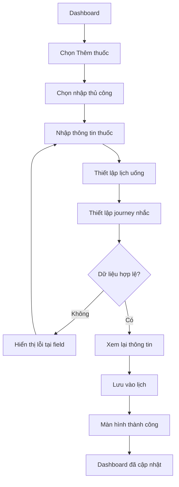

### L3 — System flow

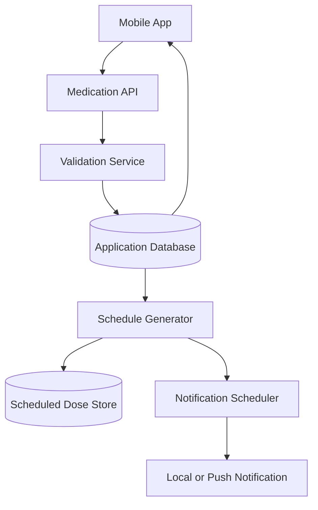

---

## 17.2. Flow B — OCR đơn thuốc

### L0 — Intent & Outcome

* Người dùng chụp đơn thuốc.
* Hệ thống hỗ trợ nhập dữ liệu.
* Người dùng kiểm tra kết quả.
* Chỉ dữ liệu đã xác nhận mới được đưa vào lịch.

### L1 — Business flow

1. Người dùng chụp hoặc chọn ảnh.
2. Hệ thống kiểm tra chất lượng ảnh.
3. Hệ thống gửi ảnh đến OCR pipeline.
4. OCR trích xuất text và cấu trúc thuốc.
5. Hệ thống gắn trạng thái tin cậy cho từng field.
6. Người dùng review và chỉnh sửa.
7. Người dùng xác nhận.
8. Hệ thống tạo medication và schedule.

### L2 — User flow

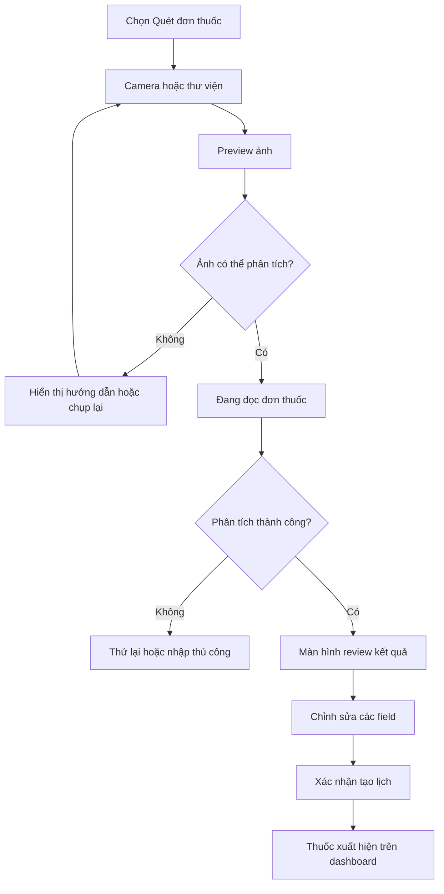

### L3 — System flow

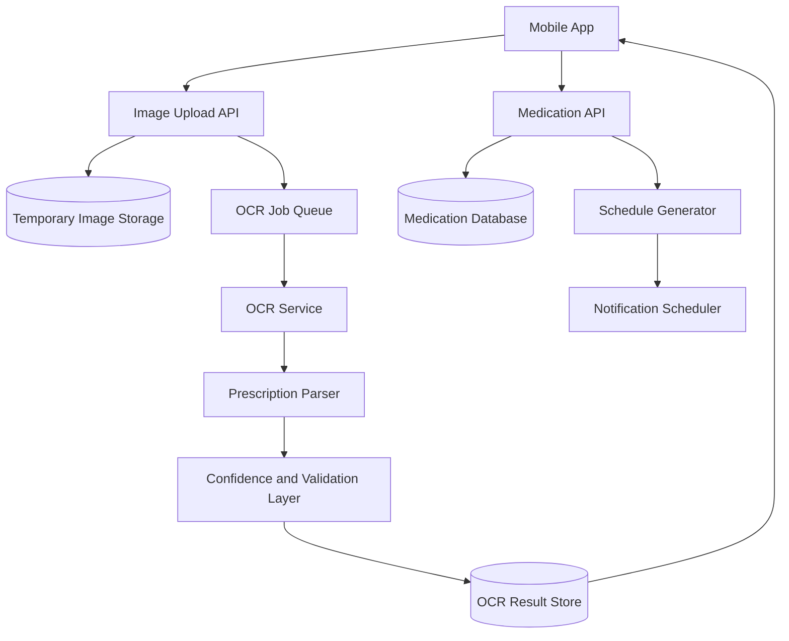

---

## 17.3. Flow C — Notification và xác nhận bằng ảnh

### L0 — Intent & Outcome

* Người dùng được nhắc đúng lúc.
* Người dùng xác nhận hoặc hoãn.
* Hệ thống dừng hoặc tiếp tục escalation theo hành động.

### L1 — Business flow

1. Đến thời gian nhắc.
2. Notification được gửi.
3. Người dùng chọn xác nhận hoặc nhắc sau.
4. Nếu xác nhận bằng ảnh, camera mở.
5. Ảnh được phân tích.
6. Warning được hiển thị nếu cần.
7. Người dùng hoàn tất xác nhận.
8. Dose được đánh dấu hoàn thành.
9. Các notification escalation còn lại được huỷ.
10. Hành vi được ghi nhận.

### L2 — User flow

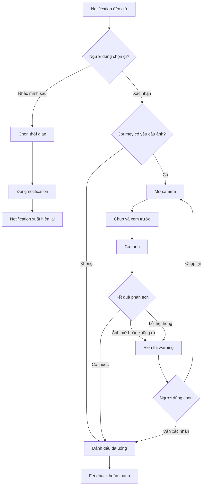

### L3 — System flow

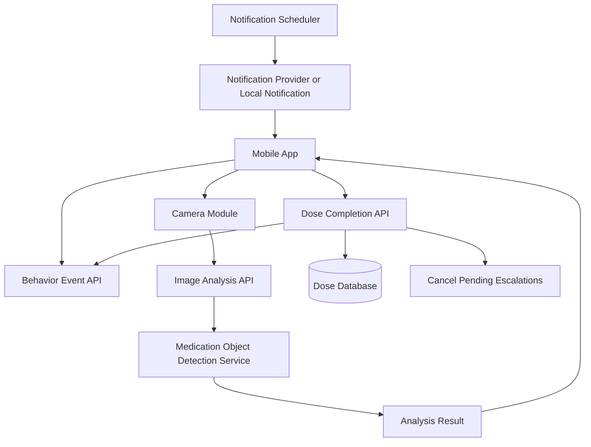

---

## 17.4. Flow D — Recap và đề xuất cá nhân hoá

### L0 — Intent & Outcome

* Người dùng hiểu hành vi tuần vừa qua.
* Hệ thống đề xuất cải thiện lịch nhắc.
* Người dùng quyết định có áp dụng hay không.

### L1 — Business flow

1. Hệ thống tổng hợp dữ liệu tuần.
2. Kiểm tra lượng dữ liệu tối thiểu.
3. Tính delay điển hình theo từng khung giờ.
4. Sinh insight và đề xuất.
5. Người dùng mở app.
6. Recap được hiển thị.
7. Người dùng đồng ý, từ chối hoặc chỉnh sửa.
8. Nếu đồng ý, lịch notification được cập nhật.
9. Thay đổi được lưu vào audit history.

### L2 — User flow

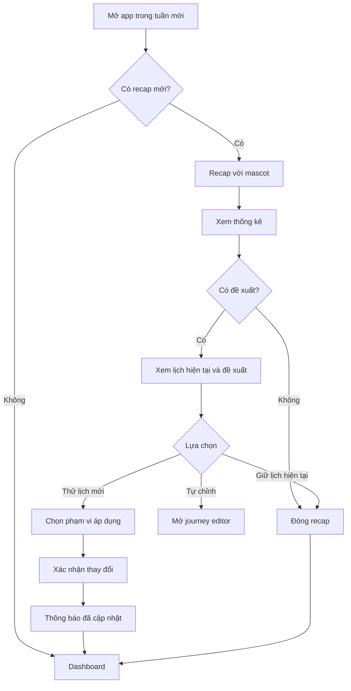

### L3 — System flow

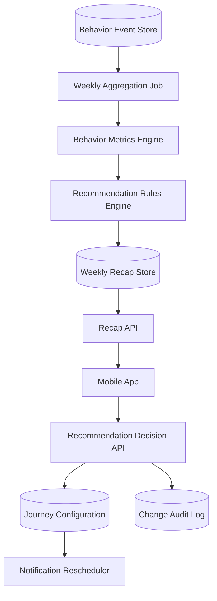

---

# 18. L4 technical workflows

## 18.1. Notification — Happy path

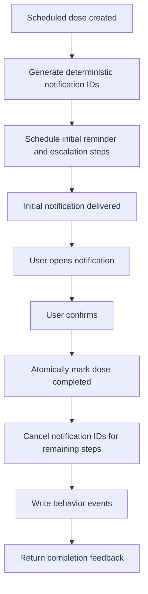

## 18.2. Notification — Error and retry

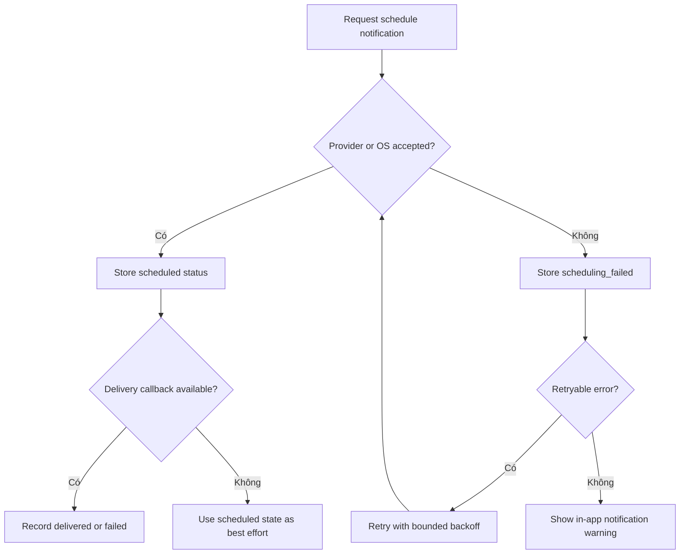

## 18.3. Notification — Idempotency and concurrency

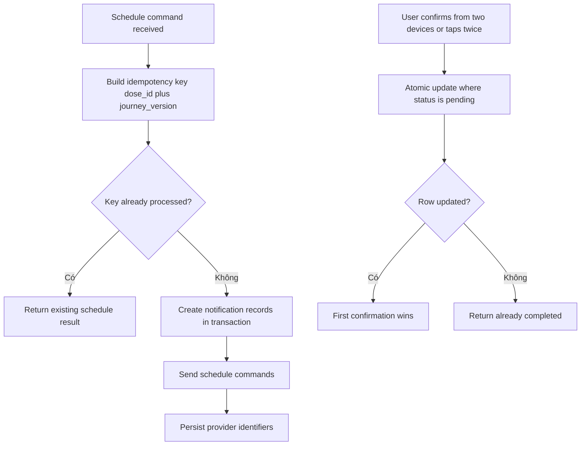

## 18.4. Notification — Edge cases

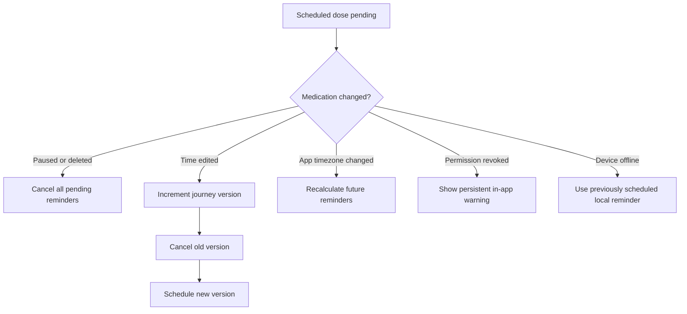

---

## 18.5. OCR — Happy path

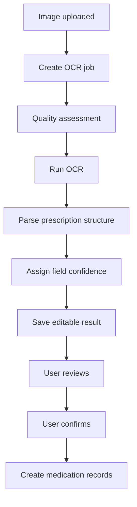

## 18.6. OCR — Error and retry

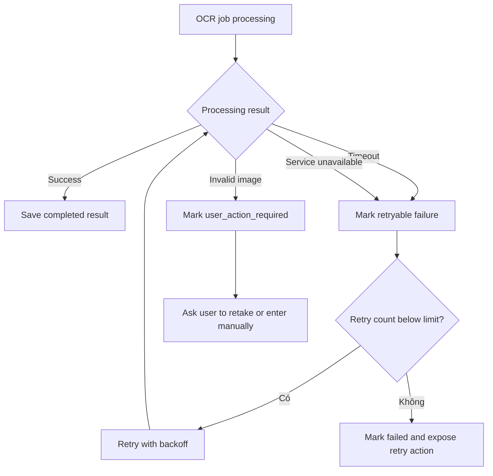

## 18.7. OCR — Idempotency and concurrency

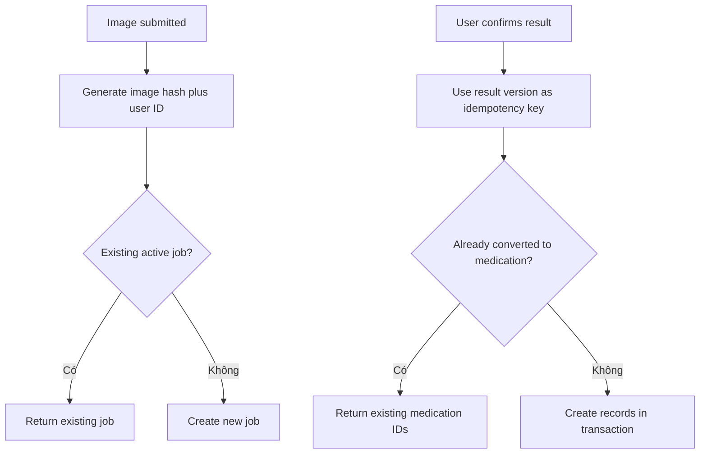

## 18.8. OCR — Edge cases

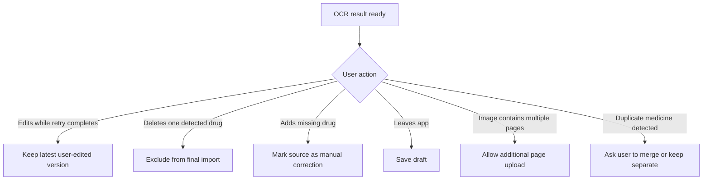

---

# 19. Data model mức khái niệm

## Medication

* id
* user_id
* name
* active_ingredient
* strength
* form
* dosage_amount
* dosage_unit
* food_instruction
* start_date
* end_date
* status
* source_type
* notes
* created_at
* updated_at

## Medication Schedule

* id
* medication_id
* session_name
* target_time
* valid_window_start
* valid_window_end
* days_of_week
* journey_config_id
* timezone
* active_from
* active_until

## Journey Configuration

* id
* user_id
* name
* preset_type
* reminder_offset
* escalation_steps
* confirmation_method
* snooze_options
* sound_mode
* max_reminders
* escalation_end_after
* version

## Scheduled Dose

* id
* medication_id
* schedule_id
* scheduled_at
* valid_until
* status
* confirmed_at
* confirmation_method
* confirmation_image_id
* delay_minutes
* journey_version

## Notification Event

* id
* scheduled_dose_id
* event_type
* escalation_level
* scheduled_at
* delivered_at
* opened_at
* action
* metadata

## OCR Job

* id
* user_id
* image_id
* status
* retry_count
* raw_text
* structured_result
* result_version
* error_code
* created_at
* completed_at

## Weekly Recap

* id
* user_id
* week_start
* week_end
* total_doses
* on_time_count
* late_count
* missed_count
* median_delay
* insight
* recommendation
* recommendation_status

---

# 20. Nội dung UX mẫu

## Empty dashboard

> **Chưa có lịch thuốc nào**
> Thêm loại thuốc đầu tiên để Mèo Miu bắt đầu nhắc bạn nhé.

CTA:

* “Quét đơn thuốc”
* “Nhập thủ công”

## Trước giờ uống

> “Còn 15 phút nữa đến giờ uống Amoxicillin. Bạn chuẩn bị thuốc và một ly nước nha.”

## Đến giờ uống

> “Đến giờ rồi nè! Amoxicillin · 1 viên · Sau ăn.”

## Người dùng chọn nhắc sau

> “Được thôi, mình sẽ quay lại sau 10 phút.”

## Hoàn thành

> “Xong rồi! Một việc nhỏ nhưng rất đáng tự hào.”

## Bỏ lỡ

> “Có vẻ lần này chưa thuận tiện. Mình đã ghi nhận để lịch nhắc sau phù hợp hơn.”

## OCR thành công

> “Mình đọc được 4 loại thuốc. Bạn kiểm tra lại một lượt trước khi thêm vào lịch nhé.”

## OCR chưa chắc chắn

> “Có vài chỗ mình chưa đọc rõ. Mình đã đánh dấu để bạn dễ kiểm tra.”

## Recap tốt

> “Tuần này bạn hoàn thành 18/20 lần uống thuốc. Miu thấy bạn đang tạo được một thói quen rất ổn đó!”

## Recap có nhiều lần trễ

> “Buổi tối tuần này có vẻ hơi khó theo kịp. Mình thử nhắc sớm hơn 15 phút nhé?”

---

# 21. Non-functional requirements

## Hiệu năng

* Dashboard hiển thị dữ liệu chính trong vòng 2 giây ở điều kiện mạng bình thường.
* Camera mở trong vòng 1 giây sau khi người dùng cấp quyền.
* Thao tác xác nhận phải phản hồi ngay trên thiết bị, không phụ thuộc hoàn toàn vào kết quả AI.
* OCR và image analysis phải có loading state rõ ràng.

## Reliability

* Không tạo duplicate scheduled doses.
* Không gửi escalation sau khi dose đã hoàn thành.
* Chỉnh lịch phải huỷ reminder cũ.
* Retry phải có giới hạn.
* Các thao tác tạo medication và schedule quan trọng phải có tính idempotent.

## Privacy

* Dữ liệu thuốc và ảnh được xem là dữ liệu nhạy cảm.
* Mã hoá dữ liệu khi truyền và khi lưu.
* Không dùng ảnh cho việc huấn luyện model nếu chưa có consent riêng.
* Cho phép người dùng xoá ảnh xác nhận.
* Cho phép chọn chế độ phân tích xong xoá ảnh.
* Log không được chứa ảnh hoặc toàn bộ nội dung đơn thuốc ở dạng plain text không cần thiết.

## Accessibility

* Screen reader đọc được tên thuốc, liều và trạng thái.
* Không phụ thuộc vào gesture phức tạp.
* Nút quan trọng có text label.
* Hỗ trợ font lớn mà không làm vỡ layout.
* Animation mascot có thể giảm hoặc tắt.

---

# 22. Success metrics

## Product metrics

* Tỷ lệ người dùng hoàn thành việc tạo thuốc đầu tiên.
* Tỷ lệ đơn OCR được xác nhận thành công.
* Thời gian trung bình để tạo lịch bằng OCR.
* Tỷ lệ scheduled doses được xác nhận.
* Tỷ lệ dose được xác nhận trong cửa sổ đúng giờ.
* Tỷ lệ notification được phản hồi.
* Tỷ lệ người dùng sử dụng “Nhắc mình sau”.
* Tỷ lệ người dùng chấp nhận đề xuất cá nhân hoá.
* Tỷ lệ giữ chân sau 7 ngày và 30 ngày.

## Guardrail metrics

* Số notification trung bình trên mỗi scheduled dose.
* Tỷ lệ người dùng tắt notification sau khi gặp escalation.
* Tỷ lệ tắt ứng dụng hoặc uninstall sau notification dày.
* Tỷ lệ ảnh bị AI cảnh báo sai.
* Tỷ lệ kết quả OCR bị người dùng chỉnh sửa.
* Số trường hợp notification vẫn tiếp tục sau khi người dùng xác nhận.

---

# 23. Rủi ro và cách giảm thiểu

## Notification gây khó chịu

**Rủi ro:** Escalation mỗi 3 phút có thể khiến người dùng tắt toàn bộ notification.

**Giảm thiểu:**

* Bắt buộc có giới hạn escalation.
* Cho phép chỉnh mức quyết liệt.
* Theo dõi tỷ lệ snooze và notification disable.
* Gợi ý giảm mức nhắc nếu người dùng thường xuyên bỏ qua.

## OCR đọc sai liều

**Rủi ro:** Người dùng tin hoàn toàn vào kết quả AI.

**Giảm thiểu:**

* Bắt buộc review.
* Highlight field không chắc chắn.
* Không tự suy đoán field bị thiếu.
* Hiển thị disclaimer rõ nhưng không gây hoảng.

## AI ảnh không nhận ra thuốc

**Rủi ro:** Người dùng bị chặn dù đã uống.

**Giảm thiểu:**

* Chỉ warning.
* Luôn có xác nhận thủ công.
* Không bắt chụp lại.
* Theo dõi false warning để cải thiện model.

## Cá nhân hoá thay đổi nhầm giờ uống

**Rủi ro:** Đề xuất vô tình ảnh hưởng chỉ định y tế.

**Giảm thiểu:**

* Chỉ đề xuất giờ bắt đầu nhắc và escalation.
* Tách rõ “giờ uống” và “giờ bắt đầu nhắc”.
* Yêu cầu xác nhận trước khi thay đổi.
* Hiển thị side-by-side trước và sau.

## Người dùng không phản hồi không đồng nghĩa chưa uống

**Rủi ro:** Recap đưa ra kết luận sai.

**Giảm thiểu:**

* Dùng từ “chưa được xác nhận” thay vì “không uống”.
* Cho phép cập nhật “Đã uống nhưng quên xác nhận”.
* Không dùng dữ liệu không chắc chắn để tạo lời phán xét.

---

# 24. Open questions

1. Người dùng có được phép xác nhận bằng ảnh từ thư viện hay chỉ dùng camera trực tiếp?
2. Ảnh xác nhận mặc định sẽ được lưu hay xoá sau khi phân tích?
3. Journey có áp dụng theo từng thuốc, từng buổi hay theo toàn bộ tài khoản?
4. Escalation tối đa nên giới hạn theo số lần hay tổng thời gian?
5. Có cần hoạt động hoàn toàn offline cho notification và xác nhận không?
6. Một buổi có nhiều thuốc thì người dùng cần chụp một ảnh chung hay xác nhận từng thuốc?
7. Khi người dùng chọn “Bỏ qua”, có cần hỏi lý do tuỳ chọn không?
8. Recap tuần nên xuất hiện vào ngày cố định hay sau mỗi bảy ngày sử dụng?
9. Có cần hỗ trợ người thân thiết lập journey thay cho người dùng trong phiên bản sau không?
10. Tên chính thức của mascot và sản phẩm là gì?
